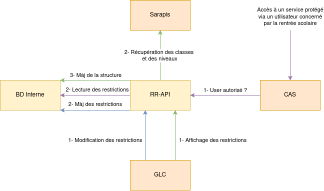

# Restriction-rentree-API

API permettant de définir une date de rentrée sur des classes/niveaux pour bloquer l'accès aux services à certaines populations.

L'image ci-dessous décrit les interactions entre les différents composants :



L'API est interrogée par 2 composants différents :
- GLC pour consulter/modifier les dates de rentrée ;
- CAS pour vérifier l'autorisation d'un utilisateur à se connecter en période de rentrée.

L'API utilise 2 bases de données :
- Sa base de données interne pour stocker les dates de rentrée sur les établissements, niveaux et classes ;
- La base Sarapis pour initialiser et mettre à jour les établissements, niveaux et classes et les liens entre ces derniers (lecture seule).

L'API est sécurisée via un mélange API-KEY et adresse IP.

**Note** : Le système suppose que pour mettre à jour une date de rentrée, l'établissement et ses niveaux/classes doivent déjà exister dans la BD interne. Cela veut dire que l'utilisateur doit passer par l'UI (qui fera une requête de lecture avant la requête de modification).

## Récupération d'une date de rentrée

Pour récupérer la date de rentrée d'une classe donnée, on utilise un système de fallback, ou on regarde si on a une date définie pour l'élément le plus spécifique puis on remonte petit à petit si ce n'est pas le cas. Le système en pseudo code peut se décrire de la manière suivante :
```
si date classe :
	retourner la date de la classe
sinon si date niveau :
		retourner la date du niveau
sinon si date etab :
	retourner la date de l'étab
sinon retourner date par défaut
```

Une date par défaut commune à tous les établissements est configurée dans l'API.

## Requête du CAS

L'API doit répondre au CAS qui va pour un utiliser envoyer une requête pour savoir s'il a le droit d'utiliser le service. L'API répond un 200 si c'est vrai, et un 401 sinon. Le CAS va transmettre à l'API deux éléments qui vont permettre d'identifier la classe de l'utilisateur (car c'est à partir de là qu'on récupère la date de rentrée, voir ci-dessus) :
- Les groupes de l'utilisateur `isMemberOf`
- L'établissement courant de l'utilisateur

A partir de ces deux éléments, on va chercher le groupe qui correspond à la classe de l'utilisateur (on aurait pu se servir d'un attribut LDAP dédié pour les élèves, mais on ne l'a pas pour les parents).

**Note** : Le système suppose que pour un même établissement 2 classes n'auront jamais le même nom (car on n'a pas l'information du niveau dans le nom du groupe, on doit donc chercher les classes de l'établissement et pas du niveau de l'établissement).
